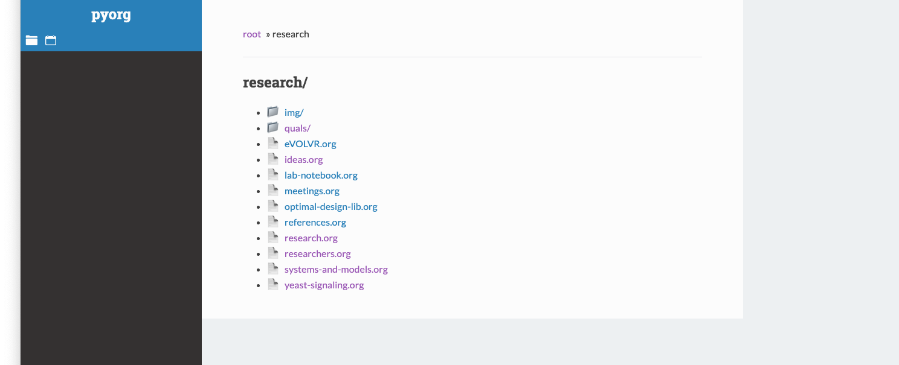
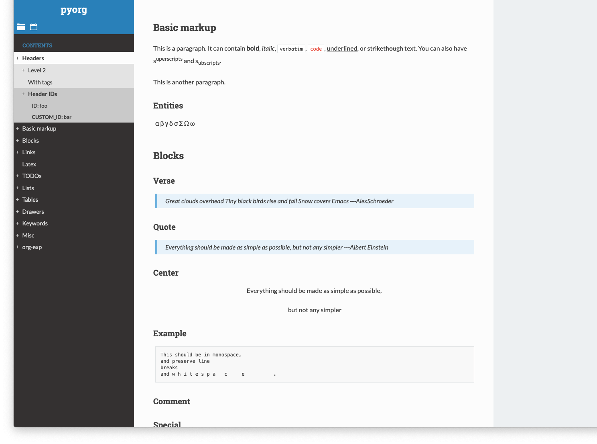
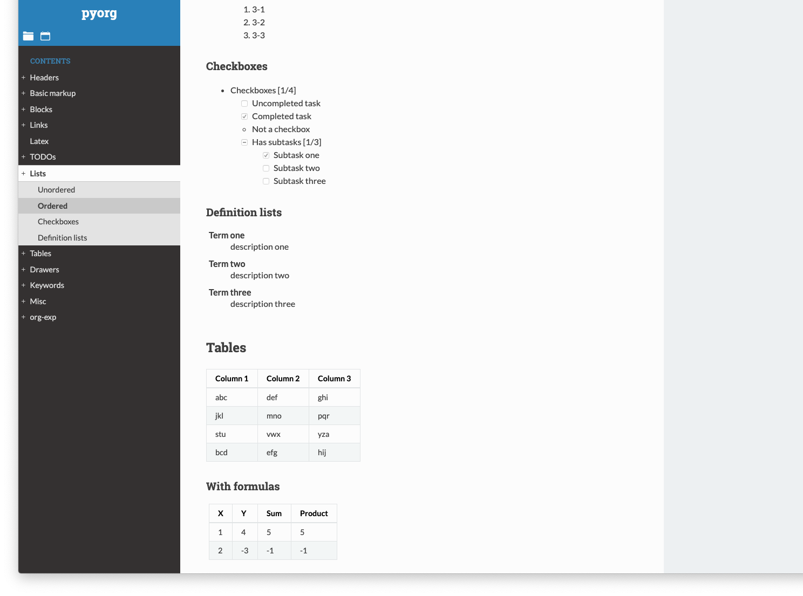
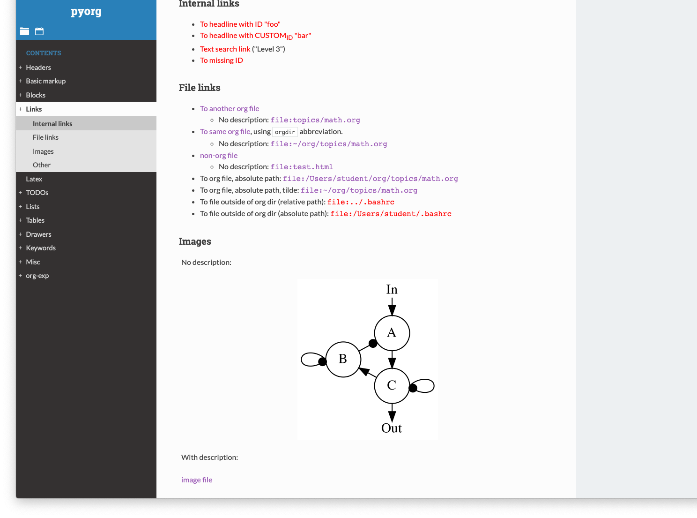
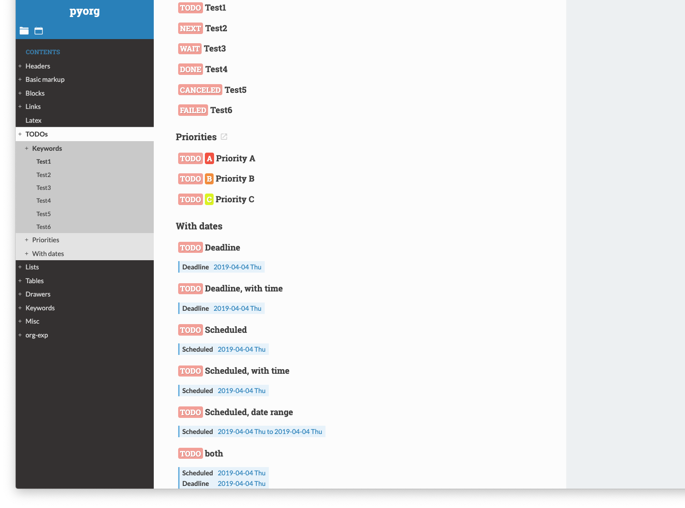

# pyorg-flask

Simple web app based on the [Flask](http://flask.pocoo.org) and
[pyorg](http://github.com/jlumpe/pyorg) packages that lets you view your Org
mode files in fancy HTML.


## Screenshots

Browse through your org directory:



View an org file:



Most document elements are already supported:








## Features

* Org files are read when you load the page, no need for manual exporting/publishing
* Uses data exported from Emacs using [ox-json](http://github.com/jlumpe/ox-json)
  instead of parsing the raw .org file, so all your customizations in `init.el`
  should work
* Serve files in your org directory, so file links and inline images work
* Click headlines to open in Emacs
* Fancy CSS based on [Read the Docs](https://github.com/readthedocs/sphinx_rtd_theme)
* LaTeX math with [MathJax](http://mathjax.org)
* Extensible


### Supported Org document elements

* Text formatting: bold, italic, code, etc.
* Quote, example, center, verse blocks
* Ordered, unordered, description lists
	* Checkboxes
* Special symbols (entities), LaTeX
* External links, file links
* Src blocks with results
* Tags, TODOs, priorities in headlines


### In-progress

* Agenda view
* Internal links, to headlines or radio targets
* Links to headlines in other files


### Planned

* Footnotes
* Figure and table captions
* Customizable TODO keyword and tag colors
* Cache file data so it isn't re-exported on every page load
* Indexing/searching files
* Plugin system for HTML conversion, to support Org mode extension packages


## Installation

### Prerequisites

Install the [ox-json](github.com/jlumpe/ox-json) Emacs package and
[pyorg](github.com/jlumpe/pyorg) Python package.


### Build front end assets

```
npm install
npm run  build
```


### Install the package

```
git clone https://github.com/jlumpe/pyorg-flask
cd pyorg-flask
python setup.py install
```


## Running the app

First, start the Emacs server with `(server-start)`. Then run

    pyorg-flask run
    
and navigate to http://localhost:5000
